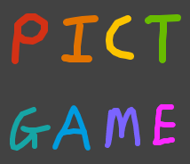

# Pictgame 🎨

A pictionary-esque game with a react + xstate frontend, node + redis microservice backend and a bot

<s>Still a work in progress!</s> Project is now in beta! Check it out at https://pg.siid.sh

# Why

Written to better acquaint myself with the abovementioned tech, and for fun

# Structure

## /front

The React-based frontend. Uses XState to manage the logic, and socket.io to communicate with the server.
It also uses SubtleCrypto to secure communications with other clients during a game session. More specifically, the handshake procedure involves ECDH, after which AES-GCM is used till the session ends. This ensures(?) that clients' data would be inaccessible (practically, at least) to any middleman having access to the server instances and/or the message broker.

A single-player mode is also included, to test out the canvas. In this mode, the user can choose to have their drawing published (read: stored) on the server, to be randomly displayed on the front page. This is the only time where the drawing is transmitted unencrypted, albeit over HTTPS.

## /back/nodejs

The backend that runs on node, and uses redis as a message broker to communicate between instances. Designed to function as a distributed system from the start, it uses the raft consensus algorithm to elect a server instance to handle matchmaking, naming and cleaning up. The raft algo guarantees at most 1 leader at any given time, and is self-healing, fault and partition tolerant.

The server instances only serve to link clients together, and has zero knowledge of the game logic.

## /bot

A simple bot microservice that functions as a standalone client/loopback interface and offers to match with clients who've been waiting to match for a while (read: who've sent >2 match requests)
